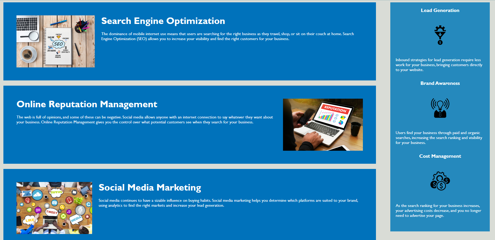

# WebUp Digital Marketing Agency

## Link to Live Application
https://digitallyalex.github.io/webup-digital-marketing/

## Description
This project came about when WebUp Digital Marketing Agency came to me to help them create a codebase that follows accessibility standards so that their own site is optimized for search engines.

The solution involved having a close look at the HTML and CSS files and refactoring to cover the following aspects:
- Making sure that semantic HTML elements can be found throughout the source code
- Checking that HTML elements follow a logical structure
- Adding descriptive alt attributes to all image and icon elements
- Verifying that all heading attributes fall in sequential order
- Modifying the title element so it's descriptive and concise

While working on the above objectives, some minor changes were made in the following areas:
- CSS file, with descriptive comments added to make it easy to find and modify the styling of the different sections of the site
- Links and anchors checked and edited to make sure the navigation bar links point to the right sections in the site

The result was positive, with the styling and positioning of the site being unaffected by the changes I made, and with a more accessible and search-engine friendly codebase for WebUp Digital Marketing.

## Installation
N/A

## Usage

Users can navigate to the different sections of the site by clicking on the links in the navigation bar.

Here, we can see the different sections of the site (without the footer), which go into more depth about the topics presented in the navigation bar. On the right hand side, users can see some of the benefits of working with the agency.

## Credits
N/A

## License
MIT License, please refer to LICENSE.md in the repo for the complete information.